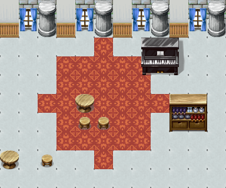
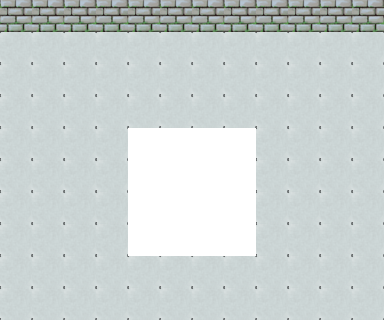
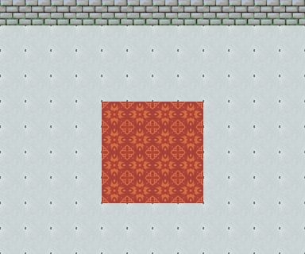

# Txt To RPG Map

[English](./README_en.md) | [中文](./README.md)

A tool for generating RPG game maps, supporting both outdoor and indoor scene rendering.

## Preview







## Key Features

This project is designed for RPG game developers with these core advantages:

**AI-Assisted Generation**: Simply describe your desired map scene in natural language, and with the built-in prompt templates, LLMs can generate complete JSON map configurations instantly. No need to manually arrange tiles - one-click rendering gives you RPG Maker-style pixel maps.

**Zero Learning Curve**: Only requires Pillow as a dependency. No database configuration or complex development environment needed. GUI tools provided for asset processing, making it easy for beginners.

**Flexible Layer System**: Supports both procedural generation (rectangles, circles, lines) and manual placement. Precise control over each object's position and layer hierarchy.

**Ready to Use**: Built-in outdoor and indoor asset libraries covering common RPG scene elements including terrain, buildings, and decorations.

**Highly Extensible**: Supports custom assets - just drop PNG images into the corresponding directory to add new tiles. Automatically detects single-tile and multi-tile objects.

## Project Structure

```
mapgenerater/
├── assets/                    # Asset resources
│   ├── tiles/                # Outdoor map tiles
│   │   ├── grass.png         # Grass (1x1)
│   │   ├── tree.png           # Tree (4x5)
│   │   ├── house.png          # House (5x6)
│   │   ├── road.png           # Road (1x1)
│   │   ├── flower.png         # Flower (1x1)
│   │   ├── wood.png           # Wood (1x3)
│   │   ├── wood2.png          # Small wood (1x1)
│   │   ├── wood3.png          # Stump (1x1)
│   │   ├── Mushroom.png       # Mushroom (1x1)
│   │   └── Street lamp.png    # Street lamp (1x3)
│   └── insidetiles/          # Indoor map tiles
│       ├── 室内地板.png       # Indoor floor (1x1)
│       ├── 室内墙.png         # Wall (1x1)
│       ├── 室内床.png         # Bed (2x3)
│       ├── 室内桌子.png       # Table (2x2)
│       └── ...
├── examples/                  # Example files
│   ├── map_layout.json        # Outdoor map config example
│   ├── indoor_template.json   # Indoor map config example
│   ├── indoor_map.json        # Indoor map example
│   └── test_floor.json        # Test config
├── tools/                     # Tool scripts
│   ├── map_renderer.py        # Map renderer (core)
│   ├── tile_selector.py       # Tile selector GUI
│   ├── tile_annotator.py      # Multi-tile annotation tool
│   └── analyze_tiles.py       # Tile analysis tool
├── prompts/                   # AI prompts
│   ├── 提示词.txt             # Outdoor map generation prompt
│   └── 室内提示词.txt         # Indoor map generation prompt
├── docs/                      # Documentation
│   ├── tiles_list.txt         # Outdoor tiles list
│   ├── insidetiles_list.txt   # Indoor tiles list
│   └── tile_selector_readme.txt
├── output/                    # Output directory
│   └── output_map.png         # Rendered result
└── README_en.md              # English documentation
```

## Installation

### Dependencies

```bash
pip install Pillow
```

Pillow is the only external dependency, used for image processing.

## Usage

### 1. Map Renderer (Core Tool)

Render JSON config files to generate map images:

```bash
# Default render
python tools/map_renderer.py

# Specify config file
python tools/map_renderer.py examples/map_layout.json

# Specify tiles directory
python tools/map_renderer.py -t assets/tiles
```

Output: `output/output_map.png`

### 2. Tile Selector

A GUI tool for selecting and cropping tiles from larger images:

```bash
python tools/tile_selector.py
```

Features:
- Open image files
- Drag to select regions
- Export selected regions as individual images

### 3. Tile Annotator

Tool for annotating multi-tile object positions and sizes:

```bash
python tools/tile_annotator.py
# Requires image path, e.g.:
# python tools/tile_annotator.py "path/to/tileset.png"
```

Features:
- Display grid lines
- Select multi-tile regions
- Save annotation config

### 4. Tile Analyzer

Analyze image specifications in a tileset directory:

```bash
# Analyze indoor tiles
python tools/analyze_tiles.py assets/insidetiles

# Analyze outdoor tiles
python tools/analyze_tiles.py assets/tiles
```

## JSON Config Format

### Basic Structure

```json
{
  "mapName": "Map Name",
  "tileSize": 32,
  "width": 20,
  "height": 15,
  "defaultTile": "grass",
  "layers": [...]
}
```

### Layer Types

1. **procedural**: Procedural generation
   - `rectangle`: Rectangular area
   - `circle`: Circular area
   - `line`: Straight line

2. **grid**: Complete 2D array

3. **sparse**: Sparse array, only listing object positions

### Example

```json
{
  "layers": [
    {
      "name": "Ground Layer",
      "type": "procedural",
      "rules": [
        {"type": "rectangle", "tile": "road", "x1": 5, "y1": 4, "x2": 14, "y2": 10}
      ]
    },
    {
      "name": "Objects Layer",
      "type": "sparse",
      "data": [
        {"tile": "house", "x": 3, "y": 3},
        {"tile": "tree", "x": 2, "y": 2}
      ]
    }
  ]
}
```

## AI-Assisted Generation

Use the prompt files in `prompts/` directory with AI to generate map layout JSON:

1. Copy the prompt for AI
2. Describe the map you want
3. AI generates JSON config
4. Save as JSON file
5. Use renderer to generate map

## Asset Specifications

- Tile size: 32x32 pixels
- Supported formats: PNG, JPG, BMP
- Multi-tile objects: Automatically calculated based on image size

## License

MIT License
